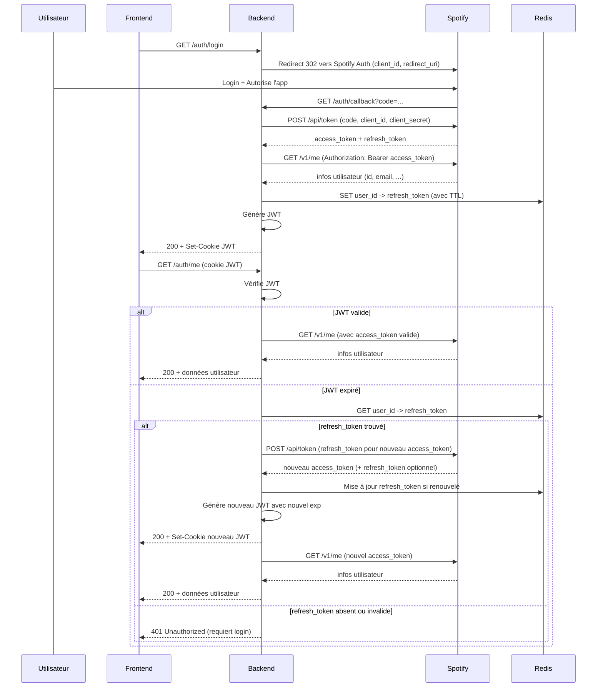

```mermaid

sequenceDiagram
    participant Utilisateur
    participant Frontend
    participant Backend
    participant Spotify
    participant Redis

    %% Étape 1 : Frontend demande la page login
    Frontend->>Backend: GET /auth/login
    Backend->>Spotify: Redirect 302 vers Spotify Auth (client_id, redirect_uri)

    %% Étape 2 : Utilisateur s'authentifie chez Spotify
    Utilisateur->>Spotify: Login + Autorise l'app

    %% Étape 3 : Spotify redirige vers backend avec code
    Spotify->>Backend: GET /auth/callback?code=...

    %% Étape 4 : Backend échange code contre tokens
    Backend->>Spotify: POST /api/token (code, client_id, client_secret)
    Spotify-->>Backend: access_token + refresh_token

    %% Étape 5 : Backend récupère les infos utilisateur
    Backend->>Spotify: GET /v1/me (Authorization: Bearer access_token)
    Spotify-->>Backend: infos utilisateur (id, email, ...)

    %% Étape 6 : Backend stocke refresh_token dans Redis avec clé user_id
    Backend->>Redis: SET user_id -> refresh_token (avec TTL)

    %% Étape 7 : Backend crée JWT (sub=user_id, exp=15min, jti=uuid)
    Backend->>Backend: Génère JWT

    %% Étape 8 : Backend renvoie JWT au frontend (cookie HttpOnly)
    Backend-->>Frontend: 200 + Set-Cookie JWT

    %% Étape 9 : Frontend fait requête authentifiée
    Frontend->>Backend: GET /auth/me (cookie JWT)
    Backend->>Backend: Vérifie JWT

    alt JWT valide
        Backend->>Spotify: GET /v1/me (avec access_token valide)
        Spotify-->>Backend: infos utilisateur
        Backend-->>Frontend: 200 + données utilisateur
    else JWT expiré
        Backend->>Redis: GET user_id -> refresh_token
        alt refresh_token trouvé
            Backend->>Spotify: POST /api/token (refresh_token pour nouveau access_token)
            Spotify-->>Backend: nouveau access_token (+ refresh_token optionnel)
            Backend->>Redis: Mise à jour refresh_token si renouvelé
            Backend->>Backend: Génère nouveau JWT avec nouvel exp
            Backend-->>Frontend: 200 + Set-Cookie nouveau JWT
            Backend->>Spotify: GET /v1/me (nouvel access_token)
            Spotify-->>Backend: infos utilisateur
            Backend-->>Frontend: 200 + données utilisateur
        else refresh_token absent ou invalide
            Backend-->>Frontend: 401 Unauthorized (requiert login)
        end
    end

```